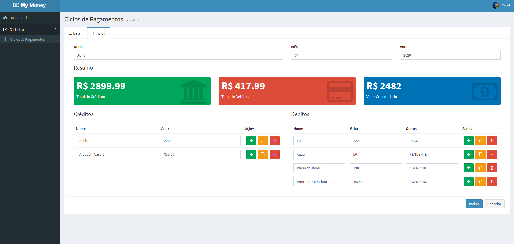

[](https://github.com/feross/standard)

<h1 align="center">My Money</h1>

Is a finance management system that is very useful for organizing weekly, monthly or any way the user sees fit, as it is totally free to create your payment cycles.

## A little bit about the screens...
<p>The homepage is a dashboard with some cards that inform the totals of credit, debit and their consolidated amount. </p>
<p> The <b>Payment Cycles</b> page lists all cycles already registered and allows their registration, editing and deletion.</p>



### :rocket: Demo
<p>The deploy was made on <b>Netlify</b> and you can access in here https://my-money-cvs.netlify.app/</p>

<p><b>PS:</b> The first request (registration or login) will take a while to return an answer because the API will be in "hibernate" mode.
The "hibernate" "mode happens because the API doesn't get a lot of constant access.</p>

## Technologies
- HTML && CSS
- Bootstrap's template <b>AdminLTE</b>
- ReactJS
- Webpack
- The state management <b>Redux</b>
- Deployed on <b>Netlify</b>

## Installation
Download NPM, Node and MongoDB.

Clone and configure the backend [My Money API.](https://github.com/carolvasc/my-money-api)

Clone this repo locally:
```sh
$ git clone https://github.com/carolvasc/my-money.git
```
Install the dependencies:
```
$ npm install
```
Open your terminal and run the application:
```sh
$ npm run dev
```

If the whole process has gone smoothly, an application available at `localhost:8080`.

<br />
<h5>Versão 1.0</h5>
